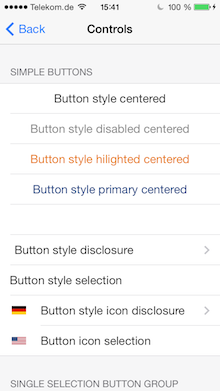
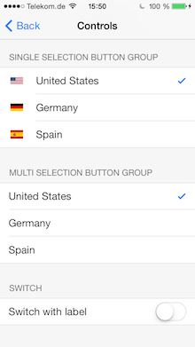
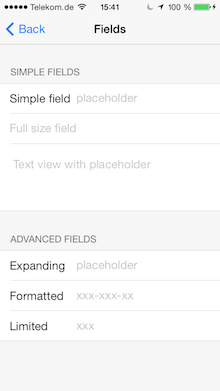
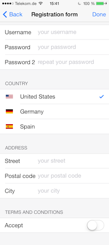

 PAYFormBuilder 
==============
[](https://github.com/paij/PAYFormBuilder/blob/master/LICENSE)
[](https://github.com/paij/PAYFormBuilder)
[](https://travis-ci.org/Eldorado234/PAYFormBuilder)

The FormBuilder is a library to create generic iOS 7/8 screens the easy way. With it's block based syntax and wide possibilities for customization it's fun to create forms.

[](Images/controls.png)
[](Images/controls2.png)
[](Images/fields.png)

Features
--------
* **Easy syntax** - with the block syntax your code is well structured and easy to understand
* **Predefined Styles** - get a seamless iOS 7/8 feeling without writing one line of styling code
* **Validation** - use validation handling and error message management out of the box
* **Customizable** - change everything the `PAYFormBuilder` configured for you - just register some blocks and wait for a call 
* **Themable** - You decide, how your form should look like
* **Auto layout compatible** - For full flexibility all elements are positioned with auto layout
* **Example app** - get an overview over all posibilities of the lib and see how to get the best out of it

Structure
---------
This short overview of the structure written in objective-c-pseudo-code should give you an idea of how to work with FormBuilder.
```
@class YourTableViewController : PAYFormTableViewController

- loadStructure: tableBuilder {
  [tableBuilder addSection:^(sectionBuilder){
  	[sectionBuilder addRow]
  	[sectionBuilder addRow]
  }]
  [tableBuilder addSection:^(sectionBuilder){
  	[sectionBuilder addRow]
  }]
}
```

Usage
-----
In order to create a form screen, you have to inherit from the `PAYFormTableViewController` and implement the `loadStructure:` method. All of your configuration should take place in this method.

```obj-c
#import "PAYFormBuilder.h"

@interface YourViewController : PAYFormTableViewController

@end
```

```obj-c
#import "YourViewController.h"

@implementation YourViewController

- (void)loadStructure:(PAYFormTableBuilder *)tableBuilder {
    // Build your form here   
}

@end
```

### Sections
With the `tableBuilder` you are able to add sections to the form and do some form-wide configuration. To add sections you use the following method or one of its convenience counter parts.

```obj-c
- (PAYFormSection *)addSectionWithName:(NSString *)name 
 				    	    labelStyle:(PAYFormTableLabelStyle)style 
 						   headerBlock:(void(^)(PAYFormHeader *))headerBlock 
 						  contentBlock:(void(^)(PAYFormSectionBuilder *)contentBlock
``` 

The most important parameter is the `contentBlock` which is defined as `^(PAYFormSectionBuilder *sectionBuilder)`. In this block, you are able to add fields, buttons and more (see row section).

### Rows
With the `sectionBuilder` you have a factory object to create a variety of different row types. There are predefined methods to create:

* text fields
* text views
* buttons
* button groups (list of connected buttons)
* switches

But there is also a generic `addView:` method you could call on the `sectionBuilder`  where you get an empty `PAYFormView`, which only holds a table view cell you could configure on your own. Please note, that for all row types there are factory methods where you could pass a `configureBlock`, so you could always change them the way you like.

### Error Handling
In the library there are two ways of error handling. Both are based on the error codes of `NSError`. For the builtin validation functions, these are listed in the `PAYErrorCodes.h`file. For your custom validations, you define them when throwing an error.

* **Custom**: Just set the `formFailBlock` of the `PAYFormBuilder`. You get notified when the user finished the form with errors. To distinguish between different errors use the error code of the `NSError`.
* **Automatic**: By default, the automatic error handling is activated, which shows an error alert to the user when he made a mistake. You configure this error handler in the following way:
  * Call `setErrorMessage:forErrorCode:` on
    * the `PAYFormDefaultErrorHandler` class
    * on the `PAYFormView` class or of one of its subclasses (`PAYFormField`, `PAYFormButton`, ...)
    * on instances of the `PAYFormView` class or of one of its subclasses
  
    The rule of thumb for the priority of the error messages is: the more specific a class/instance is, the higher the priority. Instances have a higher priority than classes. The error messages are of the type `PAYFormErrorMessage`. Look at the initializer of the class for different ways of error message creation.
    
  * Call `setButtonText:` on the `PAYFormDefaultErrorHandler` class to configure the button that dismisses the alert. This step is **required**.

### Custom text delegates
The delegates of the wrapped `UITextField` and the `UITextView` are set by the framework to support validation and format features. To add custom delegates, just set them as  `delegate` of the ViewHolder (`PayFormSingleLineTextField` for example). If the `maxTextLength` validation contstraint succeeds, your delegate will be executed with the formatted text. 

### Theming
Just take a look at the `utils/theming` folder to see, which theme container and style properties are available. You could replace every theme by implementing one of the `PAY*Theme` protocols and set them on the `PAYStyle` class. Easier is however to just get a theme from the `PAYStyle` class and adjust different properties.

*Important* is to do the theming before you create a form. All styles are applied on form initialization, so there is no chance to update them later.

### Layout customization
Each of the container objects (`PAYFormButton`, `PAYFormSingleLineTextField`, `PAYFormHeader`, etc.) you get when creating elements, holds a list of `NSLayoutConstraint` properties, which allow you to adjust layout. Simply change the properties, disable or delete the constraints.  

The constraint properties are prefixed with the name of the view where the constraint is added to. For example the constraint property `viewControlBottomConstraint` is added to the `view` property of the container and constrains the bottom spacing of the control.

Example
-------
To create a registration form is a common task in app development, so it is here used as example to show some of the possiblities of the PAYFormBuilder. To get an overview of all features, please run the example app.

[](Images/registrationForm3.png)

```obj-c
#import <UIKit/UIKit.h>
#import "PAYFormBuilder.h"

@interface PAYRegistrationFormViewController : PAYFormTableViewController

@end
```

```obj-c
#import "PAYRegistrationFormViewController.h"

@interface PAYRegistrationFormViewController ()

@property (nonatomic, retain) PAYFormSingleLineTextField *userNameField;
@property (nonatomic, retain) PAYFormSingleLineTextField *passwordField1;
@property (nonatomic, retain) PAYFormSingleLineTextField *passwordField2;

@property (nonatomic, retain) PAYFormSingleLineTextField *streetTextField;
@property (nonatomic, retain) PAYFormSingleLineTextField *postalCodeTextField;
@property (nonatomic, retain) PAYFormSingleLineTextField *cityTextField;

@property (nonatomic, retain) PAYFormButtonGroup *countryButtonGroup;
@property (nonatomic, retain) PAYFormSwitch *formSwitch;

@end

@implementation PAYRegistrationFormViewController


- (void)loadStructure:(PAYFormTableBuilder *)tableBuilder {
    [tableBuilder addSectionWithName:nil
                          labelStyle:PAYFormTableLabelStyleNone
                        contentBlock:^(PAYFormSectionBuilder *sectionBuilder) {
        self.userNameField = [sectionBuilder addFieldWithName:@"Username" placeholder:@"your username"
                                               configureBlock:^(PAYFormSingleLineTextField *formField) {
                                                   formField.required = YES;
                                                   formField.minTextLength = 4;
                                               }];
        
        self.passwordField1 = [sectionBuilder addFieldWithName:@"Password" placeholder:@"your password"
                                                configureBlock:^(PAYFormSingleLineTextField *formField) {
                                                    [formField activateSecureInput];
                                                }];
        self.passwordField2 = [sectionBuilder addFieldWithName:@"Password 2" 
                                                   placeholder:@"repeat your password"
                                                configureBlock:^(PAYFormSingleLineTextField *formField) {
                                                    [formField activateSecureInput];
                                                }];
    }];
    
    [tableBuilder addSectionWithName:@"Country"
                          labelStyle:PAYFormTableLabelStyleSimple
                        contentBlock:^(PAYFormSectionBuilder *sectionBuilder) {
                            self.countryButtonGroup = [sectionBuilder addButtonGroupWithMutliSelection:NO
                                contentBlock:^(PAYFormButtonGroupBuilder *^buttonGroupBuilder) {
                                    NSArray *countries = @[
                                    		@[@"United States", @"usa"], 
                                    		@[@"Germany", @"de"], 
                                    		@[@"Spain", @"es"]
                                    ];
                                    for (NSArray *country in countries) {
                                        [buttonGroupBuilder addOption:country[1] 
                                        		              withText:country[0] 
                                        		                  icon:[UIImage imageNamed:country[1]]];
                                    }
                                    [buttonGroupBuilder select:@"usa"];
                                }];
                            [self.countryButtonGroup select:YES value:@"usa"];
                        }];
    
    [tableBuilder addSectionWithName:@"Address"
                          labelStyle:PAYFormTableLabelStyleSimple
                        contentBlock:^(PAYFormSectionBuilder *sectionBuilder) {
        self.streetTextField = [sectionBuilder addFieldWithName:@"Street" placeholder:@"your street"
                                                 configureBlock:^(PAYFormSingleLineTextField *formField) {
                                                     formField.required = YES;
                                                     formField.expanding  = YES;
                                                 }];
        
        self.postalCodeTextField = [sectionBuilder addFieldWithName:@"Postal code" 
                                                        placeholder:@"your postal code"
                                                     configureBlock:^(PAYFormSingleLineTextField *formField) {
                                                         formField.required = YES;
                                                         formField.cleanBlock = ^id(PAYFormField *formField, id value) {
                                                             NSString *strValue = value;
                                                             return [strValue stringByReplacingOccurrencesOfString:@" " 
                                                                                                        withString:@""];
                                                         };
                                                     }];
        self.cityTextField = [sectionBuilder addFieldWithName:@"City" placeholder:@"your city"
                                               configureBlock:^(PAYFormSingleLineTextField *formField) {
                                                   formField.required = YES;
                                               }];
    }];
    
   
    
    [tableBuilder addSectionWithName:@"Terms and Conditions" 
                        contentBlock:^(PAYFormSectionBuilder *sectionBuilder) {
        self.formSwitch = [sectionBuilder addSwitchWithName:@"Accept"
                                             configureBlock:^(PAYFormSwitch *formSwitch) {
        	formSwitch.required = YES;
                                                 
           [formSwitch setErrorMessage:[PAYFormErrorMessage errorMessageWithTitle:@"Accept"
                                                                          message:@"Please accept the terms and conditions to continue"]
                          forErrorCode:PAYFormMissingErrorCode];
                                             }];
    }];
    
    tableBuilder.finishOnLastField = YES;
    tableBuilder.selectFirstField = YES;
    
    tableBuilder.validationBlock =  ^NSError *{
        if (![self.passwordField1.value isEqualToString:self.passwordField2.value]) {
            return [NSError validationErrorWithTitle:@"Password wrong" 
                                             message:@"Please enter the same password again" 
                                             control:self.passwordField2];
        }
        return nil;
    };
    
    tableBuilder.formSuccessBlock = ^{
        NSString *msg = [NSString stringWithFormat:@"Well done, %@. Here your cleaned postal code: %@. Country code: %@",
                         self.userNameField.value, self.postalCodeTextField.cleanedValue, self.countryButtonGroup.value];
        
        UIAlertView *alertView  = [[UIAlertView alloc]initWithTitle:@"Success"
                                                            message:msg
                                                           delegate:nil
                                                  cancelButtonTitle:@"Ok"
                                                  otherButtonTitles: nil];
        [alertView show];
    };
}


@end
```

Installation
------------

### Cocoapods

[CocoaPods](http://www.cocoapods.org) is the recommended way to add PAYFormBuilder to your project.

1. Add a pod entry for PAYFormBuilder to your *Podfile* `pod 'PAYFormBuilder'`.
2. Install the pod(s) by running `pod install`.
3. Include PAYFormBuilder wherever you need it with `#import "PAYFormBuilder.h"`.


### Source files

1. Add the repository as a git submodule to your git-tracked project.
2. Drag and drop the **PAYFormBuilder** directory from the archive in your project navigator. Make sure to select *Copy items* when asked if you extracted the code archive outside of your project.
3. Include PAYFormBuilder wherever you need any component with `#import "PAYFormBuilder.h"`.


### Static library

1. Drag and drop **PAYFormBuilder.xcodeproj** in your project navigator.
2. Select your target and go to the *Build Phases* tab. In the *Link Binary With Libraries* section select the add button. On the sheet find and add libPAYFormBuilder.a.
3. Add Target **PAYFormBuilder** to your *Target Dependencies* list.
4. `import <PAYFormBuilder/PAYFormBuilder.h>` wherever you want to use the components. You could add it to your Prefix header file, if you want.

Migration
---------
### 1.x -> 2.x
* `PAYFormButton` now has a `label` property instead of `titleLabel`
* `PAYFormView` (and it's subclasses `PAYFormButton`, `PAYFormSingleLineTextField`, etc.) now has a `cell` property, which allows to configure or replace the cell. Still use the `view` property to add subviews.
* The names of the `PAYFormButtonStyle`s were [changed](https://github.com/Eldorado234/PAYFormBuilder/commit/b0c297c1ef233cd90965226d6aaf243adc1e7641)
* All frame calculations were replaced by auto layout, so frames should't be set manually anymore
* `initWithFrame:` calls should be removed  
* Use the all new theming API to style your forms

Requirements
------------
* iOS 7+
* ARC
* BlocksKit
* libextobjc
* SZTextView
